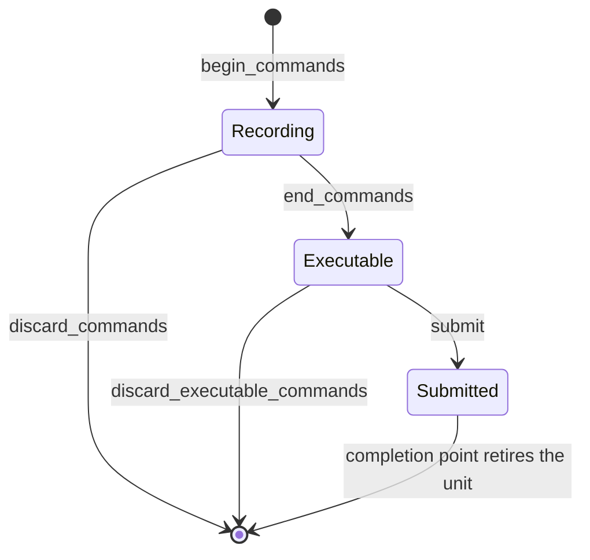

# Commands and rendering

Command allocators, the command-list lifecycle, and every `cmd_*` call.



## Command allocators

```c3
gpu::Queue queue = gpu::get_queue(&device, gpu::QueueKind.GRAPHICS)!;
gpu::CommandAllocatorDesc desc = {
    .command_buffer_capacity          = 8,    // 0 selects 8
    .max_resource_references_per_list = 64,   // 0 selects 64; FULL validation only
    .debug_name                       = "frame_allocator",
    .max_acceleration_structure_geometries_per_build = 0,  // >0 enables AS builds
};
gpu::CommandAllocator allocator = gpu::create_command_allocator(&device, queue, &desc)!;
defer (void)gpu::destroy_command_allocator(&allocator);
```

An allocator is bound to one queue and owns `command_buffer_capacity`
reusable units. Each `begin_commands` takes a unit; the unit returns when
its submission's completion point retires. A `null` descriptor selects the
defaults. Maxima: `MAX_COMMAND_ALLOCATOR_CAPACITY` (4,096) units and
`MAX_COMMAND_REFERENCES_PER_LIST` (4,096) references.

One allocator has one recording thread while any recording is live.
Different allocators record in parallel. `destroy_command_allocator` never
waits and fails while a unit is recording, executable, or submitted.

## Command lists

```c3
gpu::CommandList commands = gpu::begin_commands(&allocator)!;
defer (void)gpu::discard_commands(&commands);
// cmd_* calls ...
gpu::ExecutableCommandList executable = gpu::end_commands(&commands)!;
defer (void)gpu::discard_executable_commands(&executable);
```

`begin_commands` returns `DEVICE_BUSY` when no unit is free; wait on an
older completion point and retry. `end_commands` consumes the recording
token. `submit` consumes the executable token. The deferred discards are
no-ops after a successful consume and free the unit on an early fault.

Copies of a token are aliases of one record. All aliases are confined to
the recording thread and die together.

## Transfers

```c3
gpu::BufferCopyDesc copy = { .src = staging_span, .dst = buffer_span };
gpu::cmd_copy_buffer(&commands, &copy)!;

gpu::cmd_fill_buffer(&commands, buffer_span, 0)!;   // 32-bit pattern, 4-byte aligned span

gpu::BufferTextureCopyDesc upload = {
    .src     = staging_span,
    .texture = texture,
    .mip     = 0,
    // zero width/height/depth = whole mip; zero row_length_texels = tightly packed
};
gpu::cmd_copy_buffer_to_texture(&commands, &upload)!;

gpu::TextureBufferCopyDesc readback = { .texture = texture, .dst = readback_span };
gpu::cmd_copy_texture_to_buffer(&commands, &readback)!;
```

Copies validate bounds, usage, and queue support. They do not transition
textures or make results host-visible; record a barrier for each.

## Compute

```c3
gpu::cmd_bind_pipeline(&commands, compute_pipeline)!;
gpu::cmd_dispatch(&commands, root_address, { groups_x, 1, 1 })!;
gpu::cmd_dispatch_indirect(&commands, root_address, args_span)!;   // one DispatchIndirectCommand
gpu::cmd_dispatch_generated(&commands, records_span, count_span, max_count)!;
```

`root_address` is pushed unchanged; zero is allowed. Group counts must fit
`DeviceCaps.max_compute_work_group_count`. Indirect argument memory is a
caller-owned span made visible with a barrier to `.indirect`.

## Render passes

```c3
gpu::AttachmentViewDesc view_desc = { .texture = target, .mip_level = 0, .array_layer = 0 };
gpu::AttachmentViewHandle view = gpu::create_attachment_view(&device, &view_desc)!;
defer (void)gpu::destroy_attachment_view(&device, view);

gpu::ColorTargetDesc[1] colors = {{
    .view     = view,
    .load_op  = gpu::LoadOp.CLEAR,
    .store_op = gpu::StoreOp.STORE,
    .clear    = { .rgba = { 0, 0, 0, 1 } },
}};
gpu::DepthTargetDesc depth = {
    .view     = depth_view,
    .load_op  = gpu::LoadOp.CLEAR,
    .store_op = gpu::StoreOp.DONT_CARE,
    .clear    = { .depth = 1.0f },
};
gpu::RenderPassDesc pass = {
    .colors = colors[..],
    .depth  = &depth,          // null for no depth
    .width  = width,
    .height = height,
};

gpu::cmd_begin_render_pass(&commands, &pass)!;
gpu::cmd_bind_pipeline(&commands, pipeline)!;
gpu::cmd_set_graphics_state(&commands, &state)!;
// draws ...
gpu::cmd_end_render_pass(&commands)!;
```

The required order inside a pass: bind a compatible pipeline, set a
complete `GraphicsState`, draw. Pass begin does not bind, set, or
transition anything. Attachments must already be in `COLOR_ATTACHMENT` or
`DEPTH_ATTACHMENT` layout. Pipeline compatibility is the ordered color
formats, depth format, and sample count. `ColorTargetDesc.resolve_view`
names a single-sample target for a multisample attachment.

`ClearColor` is a union: `rgba` for float and normalized formats,
`uint_rgba` for integer formats.

Swapchain images come with an `AttachmentViewHandle` in `AcquiredImage`.
`create_attachment_view` is for application textures. Destroy attachment
views after their last submitted use retires.

## Graphics state

```c3
gpu::GraphicsState state = gpu::render_geometry_state(width, height)!;
state.color.targets = targets[..];
gpu::cmd_set_graphics_state(&commands, &state)!;

gpu::Viewport half = { .width = width / 2.0f, .height = (float)height, .max_depth = 1.0f };
gpu::cmd_set_viewport(&commands, &half)!;
gpu::ScissorRect clip = { .x = 10, .y = 10, .width = 100, .height = 100 };
gpu::cmd_set_scissor(&commands, &clip)!;
```

`cmd_set_graphics_state` applies the whole packet. `cmd_set_viewport` and
`cmd_set_scissor` override one field each after a complete state exists.
Binding a pipeline or beginning a pass does not reset state. Fields are
described in [shaders and pipelines](shaders_and_pipelines.md#graphics-pipelines).

## Draws

All draws take a vertex root and a fragment root, pushed unchanged. Zero
is allowed.

```c3
gpu::cmd_draw(
    commands:       &commands,
    vertex_root:    vroot,
    fragment_root:  froot,
    vertex_count:   36,
    instance_count: 1,
)!;

gpu::cmd_draw_indexed(
    commands:       &commands,
    vertex_root:    vroot,
    fragment_root:  froot,
    index_span:     index_span,
    index_count:    36,
    instance_count: 1,
    index_type:     gpu::IndexType.U16,   // default U32
)!;

gpu::cmd_draw_indirect(
    commands:      &commands,
    vertex_root:   vroot,
    fragment_root: froot,
    args:          args_span,      // DrawIndirectCommand[draw_count]
    draw_count:    draw_count,
)!;

gpu::cmd_draw_indexed_indirect_count(
    commands:       &commands,
    vertex_root:    vroot,
    fragment_root:  froot,
    args:           args_span,
    count_span:     count_span,    // one uint written by the GPU
    max_draw_count: max_draws,
    index_span:     index_span,
)!;
```

`cmd_draw_indexed_indirect` is the counted form without the count span.
Indirect draw counts must fit `DeviceCaps.max_draw_indirect_count`;
`cmd_draw_indexed_indirect_count` needs `DeviceCaps.draw_indirect_count`.

## Generated work

Generated records carry roots and arguments together
(`GeneratedDrawRecord`, `GeneratedDrawIndexedRecord`,
`GeneratedDispatchRecord`). They need `DeviceCaps.generated_work` and a
reservation on the allocator, made while it is idle:

```c3
gpu::GeneratedWorkReservationDesc reservation = {
    .pipeline              = pipeline,
    .kind                  = gpu::GeneratedWorkKind.DRAW_INDEXED,
    .max_commands_per_list = 4096,   // records one call may read
    .concurrent_lists      = 3,      // generated calls in flight at once
};
gpu::reserve_generated_work(&allocator, &reservation)!;
...
gpu::cmd_draw_indexed_generated(
    commands:       &commands,
    records:        records_span,
    count_span:     count_span,
    max_draw_count: 4096,
    index_span:     index_span,
)!;
...
gpu::release_generated_work(&allocator, pipeline, gpu::GeneratedWorkKind.DRAW_INDEXED)!;
```

The backend derives and owns the private storage. Each generated call in
flight holds one unit of `concurrent_lists` until its command unit
retires, so two calls in one list use two units. Reserving the same key
again replaces the reservation. The reservation table holds 64 units per
command buffer; exceeding it returns `COMMAND_ALLOCATOR_CAPACITY_EXCEEDED`.
A generated call that exceeds its reservation returns
`GENERATED_SCRATCH_EXHAUSTED` and records nothing.

## Acceleration-structure commands

Valid outside a render pass on graphics or compute queues. The allocator
must have `max_acceleration_structure_geometries_per_build` at least the
geometry count (one for a TLAS).

```c3
gpu::cmd_build_acceleration_structure(&commands, &build_desc)!;
gpu::cmd_update_acceleration_structure(&commands, &build_desc)!;               // in place; allow_update
gpu::cmd_build_acceleration_structure_indirect(&commands, &build_desc, ranges_span)!;
gpu::cmd_update_acceleration_structure_indirect(&commands, &build_desc, ranges_span)!;
gpu::cmd_clone_acceleration_structure(&commands, source, destination)!;
```

`AccelerationStructureBuildDesc` names the destination, ordered geometry
build inputs (or an instance span and count for a TLAS), and caller scratch.
Direct builds carry actual counts; indirect builds carry CPU maxima and
read one `AccelerationStructureIndirectBuildRange` per geometry from
`ranges_span`. Clone uses no scratch.

None of these insert barriers. Order them with
`.acceleration_structure_build` on both sides of a `Barrier`. Under `FULL`
validation the destination and every named span are retained until the
list retires. Details: [memory and resources](memory_and_resources.md#acceleration-structures).

## Ray tracing commands

Valid outside a render pass on a graphics or compute queue whose native
family supports compute. A ray-tracing pipeline must be bound.

```c3
gpu::cmd_bind_pipeline(&commands, ray_pipeline)!;
gpu::cmd_set_ray_tracing_pipeline_stack_size(&commands, stack_bytes)!;   // dynamic_stack_size pipelines only
gpu::cmd_trace_rays(
    commands:             &commands,
    root:                 root_address,
    shader_binding_table: &sbt,
    dimensions:           { width, height, 1 },
)!;
gpu::cmd_trace_rays_indirect(
    commands:             &commands,
    root:                 root_address,
    shader_binding_table: &sbt,
    args:                 dims_span,      // TraceRaysIndirectCommand
)!;
gpu::cmd_trace_rays_indirect2(&commands, root_address, packet_span);   // TraceRaysIndirectCommand2
```

`cmd_trace_rays` pushes the root to all six stages. Dimensions must fit
`RayTracingPipelineCaps.max_ray_dispatch_dimensions` and their product
`max_ray_dispatch_invocation_count`. The indirect forms need
`indirect_dispatch` and `indirect2_dispatch` respectively; the argument
span is four-byte aligned and made visible with a barrier to `.indirect`.
The library never reads the packet back.

The stack-size value persists across binds of other dynamic-stack ray
pipelines and is invalidated by binding a static-stack ray pipeline.

## Labels

```c3
gpu::cmd_begin_label(&commands, "shadow pass", { 1, 0.5f, 0, 1 })!;
...
gpu::cmd_end_label(&commands)!;
```

No-ops without debug-utils support. Nesting must balance.

## Faults

| Cause | Fault |
|---|---|
| wrong token phase, unbalanced pass, or no bound pipeline | `COMMAND_RECORDING_ERROR` |
| state contradicts prior state | `INVALID_RESOURCE_STATE` |
| bad range, count, or descriptor | `INVALID_ARGUMENT` |
| stale or foreign handle | `INVALID_HANDLE` |
| unsupported queue operation or capability | `UNSUPPORTED_FEATURE` |
| reference or geometry capacity exceeded | `COMMAND_ALLOCATOR_CAPACITY_EXCEEDED` |
| generated reservation exceeded | `GENERATED_SCRATCH_EXHAUSTED` |
| no free unit | `DEVICE_BUSY` |

A failed `cmd_*` call records nothing.
