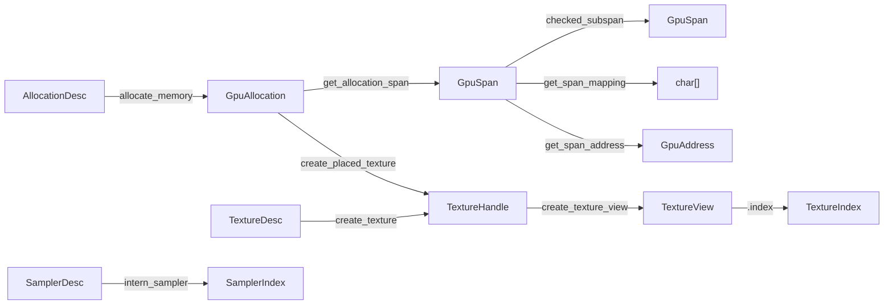
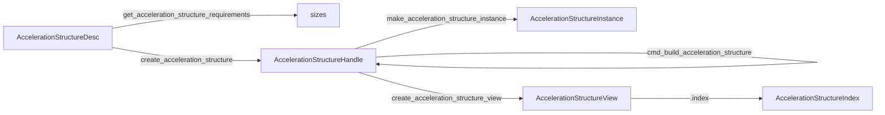

# Memory and resources

Allocations, spans, addresses, textures, views, samplers, and acceleration
structures.



## Allocations

```c3
gpu::AllocationDesc desc = {
    .size         = 64 * 1024,
    .alignment    = 16,                       // 0 selects 16
    .memory_class = gpu::MemoryClass.CPU_WRITE,
    .access       = { .graphics, .compute },  // queue roles that may touch it
    .debug_name   = "frame_data",
};
gpu::GpuAllocation allocation = gpu::allocate_memory(&device, &desc)!;
defer (void)gpu::free_allocation(&device, &allocation);
gpu::AllocationInfo info = gpu::get_allocation_info(&device, allocation)!;
```

| `MemoryClass` | Mapped | Addressable | Use |
|---|---|---|---|
| `CPU_WRITE` | yes | yes | uploads, root data, per-frame data |
| `CPU_READ` | yes | yes | readback |
| `GPU_PRIVATE` | no | yes | device-local buffers |
| `TEXTURE` | no | no | backing for placed and sparse textures |

`AllocationInfo` reports the actual `mapped`, `coherent`, and
`addressable` properties. `free_allocation` never waits; free only after
the last completion point that reads the memory. A live placed texture or
acceleration structure makes it return `RESOURCE_IN_USE`.

Allocation calls are thread-safe. Concurrent writes to overlapping mapped
bytes are the application's problem.

## Spans, mappings, addresses

A `GpuSpan` is a non-owning byte range inside an allocation.

```c3
gpu::GpuSpan whole = gpu::get_allocation_span(&device, allocation)!;
gpu::GpuSpan part  = whole.checked_subspan(256, 1024)!;   // bounds-checked
gpu::GpuSpan fast  = whole.unchecked_subspan(256, 1024);  // caller proved bounds

char[] bytes = gpu::get_span_mapping(&device, part)!;      // CPU_WRITE / CPU_READ only
gpu::GpuAddress address = gpu::get_span_address(&device, part)!;

gpu::MappedGpuSpan mapped = gpu::mapped_gpu_span(&device, part)!;  // span + bytes + address
```

After writing through a mapping:

```c3
gpu::flush_mapped_span(&device, part)!;
```

After the GPU wrote and its completion point completed:

```c3
gpu::invalidate_mapped_span(&device, part)!;
```

Both are no-ops on coherent memory and required regardless. Neither waits
for the GPU. A `GpuAddress` is a raw `ulong` valid until the allocation is
freed.

## Memory statistics

```c3
gpu::MemoryStats stats = gpu::get_memory_stats(&device)!;
String report = gpu::build_memory_report(&device, true)!;
defer report.free(mem);
```

`MemoryStats` holds up to `MAX_MEMORY_HEAPS` `MemoryHeapBudget` records,
the live allocation count, and the texture count. Numbers are advisory
under concurrent allocation.

## Textures

```c3
gpu::TextureDesc desc = {
    .width        = 1024,
    .height       = 1024,
    .depth        = 0,            // 0 = 2D, >0 = 3D
    .mip_levels   = 0,            // 0 = 1
    .array_layers = 0,            // 0 = 1
    .format       = gpu::Format.RGBA8_SRGB,
    .usage        = { .sampled, .transfer_dst },
    .access       = { .graphics },
    .sample_count = gpu::SampleCount.ONE,
    .debug_name   = "albedo",
};
if (!gpu::supports_texture_desc(&device, &desc)!) return gpu::UNSUPPORTED_FEATURE~;
gpu::TextureHandle texture = gpu::create_texture(&device, &desc)!;
defer (void)gpu::destroy_texture(&device, texture);
```

`TextureUsage` flags: `sampled`, `storage`, `color_attach`,
`depth_attach`, `transfer_src`, `transfer_dst`. `get_texture_format_support`
reports which usages, filters, and sample counts one `Format` supports.

Four creation forms:

| Function | Storage |
|---|---|
| `create_texture` | hidden dedicated allocation |
| `create_dedicated_texture` | returns `DedicatedTexture` with the texture and its allocation |
| `create_placed_texture` | a range of a caller-owned `TEXTURE` allocation |
| `create_sparse_texture` | no storage until `bind_sparse_texture_memory` |

For placement, `get_texture_requirements` returns size, alignment, a
`TextureCompatibility` value, and `dedicated_only`. The allocation's
`texture_requirements` list must include every texture placed in it. See
[the cookbook](../cookbook.md#place-several-textures-in-one-allocation).

`destroy_texture` releases the image only, never a separate or placed
allocation. It fails with `RESOURCE_IN_USE` while a view or attachment view
is live.

Limits: 2D and 3D only; multisample textures are single-mip attachments;
depth is `D32_FLOAT`; no stencil.

A cube map is a 2D texture with `cube_compatible` set: equal width and
height, single-sampled, and a layer count that is a multiple of six. Layers
hold the faces in the order +X, -X, +Y, -Y, +Z, -Z. Uploads, per-face
attachment views, and per-face 2D views use the ordinary layer paths.

## Texture views and indices

A `TextureView` publishes a subresource range to the bindless heap and owns
the slot. Its `index` is the value shaders use.

```c3
gpu::TextureView view = gpu::create_texture_view(&device, texture, null)!;  // full view
gpu::TextureViewDesc mip1 = { .base_mip = 1, .mip_count = 1 };
gpu::TextureView view_mip1 = gpu::create_texture_view(&device, texture, &mip1)!;
root.albedo = view.index;
...
gpu::destroy_texture_view(&device, view)!;   // slot is reused immediately
```

Batch creation publishes all or nothing:

```c3
gpu::TextureViewCreateDesc[2] descs = {
    { .texture = a },
    { .texture = b, .view = { .base_mip = 2, .mip_count = 1 } },
};
gpu::TextureView[2] views;
gpu::create_texture_views(&device, descs[..], views[..])!;
```

Indices are independent values. Do not compute one from another. The
texture must have `sampled` or `storage` usage. `DESCRIPTOR_HEAP_FULL`
means the runtime's `texture_heap_capacity` is exhausted.

A view with `cube` set publishes six consecutive layers from `base_layer`
as one sampled cube. The texture must be `cube_compatible` with `sampled`
usage, and `layer_count` must be 0 or 6. Cube views are sampled only; they
never receive a storage descriptor. Storage or per-face access uses a
separate 2D view of the same texture.

```c3
gpu::TextureViewDesc cube_desc = { .cube = true };
gpu::TextureView cube = gpu::create_texture_view(&device, env, &cube_desc)!;
gpu::TextureViewDesc face_desc = { .base_layer = 3, .layer_count = 1 };
gpu::TextureView face = gpu::create_texture_view(&device, env, &face_desc)!;
```

## Samplers

```c3
gpu::SamplerDesc desc = {
    .min_filter        = gpu::Filter.LINEAR,
    .mag_filter        = gpu::Filter.LINEAR,
    .mip_filter        = gpu::Filter.LINEAR,
    .address_u         = gpu::AddressMode.REPEAT,
    .address_v         = gpu::AddressMode.REPEAT,
    .address_w         = gpu::AddressMode.REPEAT,
    .max_lod           = 16.0f,
    .anisotropy_enable = caps.max_sampler_anisotropy > 0,
    .max_anisotropy    = caps.max_sampler_anisotropy,
};
gpu::SamplerIndex sampler = gpu::intern_sampler(&device, &desc)!;
```

Equal descriptions return the same index. There is no destroy; indices
live until the device does. `compare_enable` plus `compare` makes a shadow
sampler. Anisotropy above `caps.max_sampler_anisotropy` and LOD bias above
`caps.max_sampler_lod_bias` return `INVALID_ARGUMENT`, never clamp.

## Sparse textures

`create_sparse_texture` makes an image with no committed memory.
`get_sparse_texture_requirements` reports tile extents, mip-tail layout,
and the compatible page allocation shape. `bind_sparse_texture_memory`
applies one transactional `SparseTextureBindDesc` of tile and opaque binds
on a queue and returns a `CompletionPoint`.

```c3
gpu::SparseTextureTileBind[1] tiles = {{
    .aspect     = gpu::SparseTextureAspect.COLOR,
    .mip_level  = 0,
    .offset     = { 0, 0, 0 },
    .extent     = reqs.aspects[0].tile_extent,
    .allocation = page_allocation,   // GPU_ALLOCATION_INVALID unbinds
}};
gpu::SparseTextureBindDesc bind = { .texture = sparse, .tiles = tiles[..] };
gpu::CompletionPoint bound = gpu::bind_sparse_texture_memory(queue, &bind)!;
```

The library keeps no residency map. The application prevents overlap,
keeps bound allocations alive, and orders unbinds after the last user.
Binding is externally synchronized on the queue. Sparse images are
single-layer, single-sample color 2D or 3D.

## Acceleration structures

Available on devices created with `enable_ray_queries` or
`enable_ray_tracing_pipelines`. One `AccelerationStructureHandle` type
covers BLAS and TLAS.



A descriptor is an immutable capacity schema: geometry kinds and maxima
for a BLAS, `max_instance_count` for a TLAS, and build flags. Every later
build or update must match it. `get_acceleration_structure_requirements`
returns storage size and alignment, build scratch, and update scratch
(nonzero only with `allow_update`).

Creation forms mirror textures: `create_acceleration_structure` (hidden
storage), `create_placed_acceleration_structure` (range of a caller
allocation), `create_dedicated_acceleration_structure` (returns the handle
and its allocation).

Input formats:

| Geometry | Layout | Alignment |
|---|---|---|
| triangles | float32 xyz, stride ≥ 12 | address and stride 4-byte |
| indices | `U16` or `U32` | 2 or 4 bytes |
| transform | row-major 3×4 floats | 16 bytes |
| AABBs | six floats min xyz, max xyz, stride ≥ 24 | 8 bytes |
| TLAS instances | 64-byte `AccelerationStructureInstance` | 16 bytes |

`make_acceleration_structure_instance` packs a live BLAS, a transform,
custom index (24 bits), mask (8 bits), and flags into the 64-byte record.
`get_acceleration_structure_address` returns a BLAS address for GPU-authored
instances.

`create_acceleration_structure_view` publishes a TLAS to the heap. The
view owns the slot, blocks TLAS destruction while live, and exposes
`index`. Destroying it recycles the slot immediately.

Rules:

- Build inputs and scratch are caller-owned spans kept alive through the
  build's completion point. No hidden scratch, no hidden barrier.
- Updates are in place, need `allow_update`, and must follow a completed
  build or clone with the same counts.
- A clone copies a completed structure into an unbuilt destination made
  from the same descriptor. A cloned BLAS has a new address; a cloned TLAS
  needs its own view.
- After an indirect build the CPU does not know actual counts; only
  indirect updates or a new direct build may follow.
- Teardown: wait, destroy views, destroy the TLAS, destroy BLASes that its
  instances reference, then free caller-owned storage.

Recipes: [cookbook](../cookbook.md#ray-tracing).

## Shader binding tables

On a device with ray-tracing pipelines, any addressable allocation may hold
SBT records. `RayTracingShaderBindingTable` names four
`RayTracingShaderBindingTableRegion` values (span plus stride). The
ray-generation region holds exactly one record; the others may be zero.
Pack with `RayTracingPipelineCaps` alignments and
`get_ray_tracing_shader_group_handles`. The library never allocates or
fills an SBT.

## Faults

| Cause | Fault |
|---|---|
| bad range, alignment, descriptor, or limit | `INVALID_ARGUMENT` |
| zero, stale, or foreign handle | `INVALID_HANDLE` |
| unsupported usage, format, or feature | `UNSUPPORTED_FEATURE` |
| out of memory | `OUT_OF_HOST_MEMORY`, `OUT_OF_DEVICE_MEMORY` |
| fixed table full | `SLOT_TABLE_FULL` |
| heap full | `DESCRIPTOR_HEAP_FULL` |
| live child or reference | `RESOURCE_IN_USE` |

All creation here is thread-safe and transactional.
