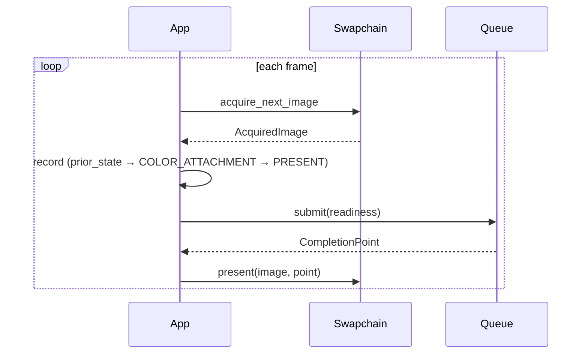

# Presentation and diagnostics

Surfaces, swapchains, the acquire-render-present loop, and the debug
callback.



## Surfaces

One `create_surface` per platform module. Native handles are borrowed;
keep the window alive until `destroy_surface`.

```c3
gpu::Surface surface = gpu::surface::x11::create_surface(
    &runtime,
    (gpu::surface::x11::DisplayHandle)display,
    (gpu::surface::x11::WindowHandle)window,
)!;
defer (void)gpu::destroy_surface(&surface);
```

| Module | Parameters after the runtime |
|---|---|
| `gpu::surface::x11` | `DisplayHandle` (`void*`), `WindowHandle` (`ulong`) |
| `gpu::surface::wayland` | `DisplayHandle` (`void*`), `SurfaceHandle` (`void*`) |
| `gpu::surface::win32` | `InstanceHandle` (`void*`), `WindowHandle` (`void*`) |

The handle types are distinct typedefs, so native pointers need an
explicit cast.

Surface creation is externally synchronized process-wide.
`destroy_surface` returns `RESOURCE_IN_USE` while a swapchain uses it.
Getting the handles from SDL3 is shown in
[getting started](../getting_started.md#window-and-surface).

## Swapchains

```c3
gpu::SwapchainDesc desc = {
    .width            = width,
    .height           = height,
    .preferred_format = gpu::Format.BGRA8_UNORM,
    .present_mode     = gpu::PresentMode.FIFO,   // unsupported modes fall back to FIFO
    .image_count      = 0,                       // backend default
    .srgb             = false,
    .debug_name       = "main_swapchain",
};
gpu::SwapchainHandle swapchain = gpu::create_swapchain(&device, &surface, &desc)!;
gpu::SwapchainInfo info = gpu::get_swapchain_info(&device, swapchain)!;
gpu::PresentModeSupport modes = gpu::get_present_mode_support(&device, swapchain)!;
```

The device must have been created with this exact surface. `SwapchainInfo`
reports the actual format, extent, image count, mode, and `dormant`.
Build pipelines against `info.format`. A dormant swapchain (zero-sized
window) has `UNDEFINED` format and zero extent; skip frames until a resize.

`PresentMode`: `FIFO` (vsync, always available), `IMMEDIATE` (no vsync),
`MAILBOX` (low-latency vsync).

## Acquire

```c3
gpu::AcquiredImage? acquired = gpu::acquire_next_image(&device, swapchain, timeout_ns);
if (catch err = acquired) {
    if (err == gpu::WAIT_TIMEOUT) return;             // skip frame
    if (err == gpu::SWAPCHAIN_OUT_OF_DATE) return resize();
    return err~;
}
```

`timeout_ns` defaults to zero (nonblocking). `AcquiredImage` holds the
`texture`, its `attachment_view`, the one-shot `readiness`, `prior_state`,
and `suboptimal`. Transition from `prior_state`; never assume a layout.

## Submit and present

```c3
gpu::SubmitDesc submit = {
    .command_lists    = lists[..],
    .readiness        = acquired.readiness,
    .readiness_before = { .color_output },
};
gpu::CompletionPoint point = gpu::submit(graphics_queue, &submit)!;

if (catch err = gpu::present(&device, &acquired, point)) {
    if (err == gpu::SWAPCHAIN_OUT_OF_DATE) return resize();
    if (err == gpu::WAIT_TIMEOUT) return;   // image intact; present again later
    return err~;
}
```

`readiness` goes into the first submit that writes the image and is
consumed by it. `present` takes that submit's completion point and consumes
the image on success. `WAIT_TIMEOUT` from `present` leaves the image
intact.

## Resize and destroy

```c3
gpu::wait_completion(last_point)!;
gpu::wait_swapchain_presentations(&device, swapchain, timeout_ns)!;
gpu::resize_swapchain(&device, swapchain, width, height)!;
// or
gpu::destroy_swapchain(&device, swapchain)!;
```

Always in that order. `resize_swapchain` and `destroy_swapchain` never
wait; `wait_swapchain_presentations` is what retires pending presents.
Its `WAIT_TIMEOUT` (zero timeout is a nonblocking query) leaves everything
intact; pump the platform event loop and retry. `RESOURCE_IN_USE` or
`DEVICE_BUSY` from resize or destroy after a successful wait means an
image was acquired and never presented, or a command list still references
the swapchain.

Resize invalidates every `AcquiredImage`. Re-read `get_swapchain_info`
and rebuild anything that depends on format or extent.

Acquire, present, resize, and the presentation wait are externally
synchronized on the swapchain. At most `MAX_SWAPCHAINS` (8) per device.

## Diagnostics

```c3
fn void on_message(gpu::DebugMessage* m, void* user_data) {
    io::printfn("[%s] %s: %s (%s)", m.severity, m.operation, m.invariant, m.rejected_field);
    if (m.has_fault) io::printfn("  fault %s", m.public_fault);
    if (m.resource.kind != gpu::DebugResourceKind.NONE) {
        io::printfn("  %s #%d %s", m.resource.kind, m.resource.index, m.resource.debug_name);
    }
}

gpu::RuntimeDesc desc = gpu::full_validation_runtime_desc();
desc.debug_callback     = &on_message;
desc.debug_user_data    = null;
desc.enable_debug_names = true;
```

`DebugMessage` fields: `severity`, `category` (`public_contract`,
`backend`, `validation`, `performance`, `resource_lifetime`, `general`),
`operation`, `has_fault` and `public_fault`, `resource`
(`DebugResourceRef`), `rejected_field`, `invariant`, `backend_text`, and
the Vulkan validation id name and number.

The callback runs synchronously on the thread that hit the condition,
possibly concurrently. Strings are valid only during the call. It must
return promptly and must not call the library. Installing a callback
changes delivery only; it does not enable checks or change returned
faults.

With `FULL` validation, `destroy_device` reports leaked children by name
and still refuses to destroy them.

## Faults

| Cause | Fault |
|---|---|
| platform or presentation unsupported | `UNSUPPORTED_FEATURE` |
| native surface lost | `SURFACE_LOST` |
| surface changed | `SWAPCHAIN_OUT_OF_DATE` |
| acquire or present timed out | `WAIT_TIMEOUT` |
| live acquisition or reference | `RESOURCE_IN_USE`, `DEVICE_BUSY` |
| swapchain table full | `SLOT_TABLE_FULL` |
| device loss | `DEVICE_LOST` |

On a retryable fault, handles and unconsumed readiness stay valid.
