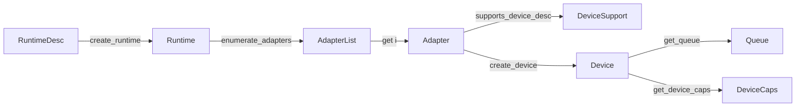

# Runtime and devices

Everything an application does starts with a `Runtime`, picks an `Adapter`,
creates a `Device`, and fetches `Queue` values from it.



## Runtime

```c3
gpu::RuntimeDesc desc = gpu::full_validation_runtime_desc();
desc.application_name = "my_app";
gpu::Runtime runtime = gpu::create_runtime(&desc)!;
defer (void)gpu::destroy_runtime(&runtime);
```

`RuntimeDesc` fields:

| Field | Zero means | Purpose |
|---|---|---|
| `contract_validation` | `TRUSTED` | `FULL` adds semantic checks and lifetime tracking |
| `enable_vulkan_validation` | off | Loads the Khronos validation layer |
| `enable_debug_names` | off | Passes `debug_name` strings to the driver |
| `texture_heap_capacity` | 4,096 | Bindless texture slots |
| `sampler_heap_capacity` | 256 | Bindless sampler slots |
| `texture_capacity` | 1,024 | Live texture table |
| `pipeline_capacity` | 256 | Live pipeline table |
| `acceleration_structure_heap_capacity` | 0 | Required nonzero for ray features |
| `pipeline_cache_data` | none | Opaque driver blob, copied at creation |
| `application_name` | none | Reported to the driver |
| `debug_callback`, `debug_user_data` | none | Structured diagnostics |

`full_validation_runtime_desc()` sets `FULL` and Vulkan validation. The
descriptor is borrowed for the call; `debug_user_data` must stay valid until
the runtime is destroyed.

`destroy_runtime` fails with `RESOURCE_IN_USE` while a device or surface is
live. Runtime and surface creation and destruction are externally
synchronized process-wide.

## Adapters

```c3
gpu::AdapterList adapters = gpu::enumerate_adapters(&runtime)!;
for (uint i = 0; i < adapters.count; i++) {
    gpu::Adapter adapter = adapters.get(i)!;
    gpu::AdapterInfo info = gpu::get_adapter_info(&adapter)!;
    gpu::AdapterDiagnostics diag = gpu::get_adapter_diagnostics(&adapter)!;
    io::printfn("%s (%s) driver %s", info.name, info.device_class, diag.driver_name);
}
```

`AdapterList` and `Adapter` are borrowed from the runtime and cost nothing
to copy. Strings in `AdapterInfo` and `AdapterDiagnostics` are valid until
the runtime is destroyed. `AdapterInfo` reports class, memory totals,
available queue roles, and limits. `AdapterDiagnostics` reports backend and
driver identity for logs.

Preflight a description before creating:

```c3
gpu::DeviceSupport support = gpu::supports_device_desc(&adapter, &desc)!;
if (!support.supported) io::printn(support.unmet_requirement);
bool can_present = gpu::supports_presentation(&adapter, &surface)!;
```

`supports_device_desc` with `null` tests the default description.
`create_device` is still authoritative; system state can change between the
two calls.

## Device

```c3
gpu::DeviceDesc desc = {
    .surface = surface,                 // optional; enables presentation
    .queues = {
        .required       = { .graphics, .compute, .transfer },
        .distinct_roles = { .compute },  // demand a separate compute queue
    },
    .enable_sparse_textures       = false,
    .enable_ray_queries           = false,
    .enable_ray_tracing_pipelines = false,
};
gpu::Device device = gpu::create_device(&adapter, &desc)!;
defer (void)gpu::destroy_device(&device);
```

A `null` or zero descriptor selects the default queue set, no surface, and
no optional features. Heap and table capacities come from the runtime.

Queue request rules:

- `required` names the roles the device must provide. Empty selects the
  defaults.
- `distinct_roles` names required roles that must not alias another
  required role.
- `single_queue = true` demands one native queue for every required role
  and for presentation. `distinct_roles` must be empty and `required` must
  be nonempty, or the request is `INVALID_ARGUMENT`. A valid request with no
  matching topology reports `supported = false` and `UNSUPPORTED_FEATURE`
  on creation.

Ray queries and ray-tracing pipelines are separate opt-ins. Either enables
acceleration structures; neither enables the other's shader model.

Creation is transactional and externally synchronized per runtime. Faults:
`UNSUPPORTED_FEATURE`, `INVALID_ARGUMENT`, `OUT_OF_HOST_MEMORY`,
`OUT_OF_DEVICE_MEMORY`, `SLOT_TABLE_FULL`, `BACKEND_ERROR`.

`destroy_device` never waits. It returns `RESOURCE_IN_USE` while any child
is live and `DEVICE_BUSY` while work is running. Destroy children first,
wait on the last completion point, then retry.

## Capabilities

```c3
gpu::DeviceCaps caps = gpu::get_device_caps(&device)!;
if (caps.async_compute) { /* compute is its own queue */ }
if (caps.draw_indirect_count) { /* cmd_draw_indexed_indirect_count works */ }
uint max_targets = caps.max_color_attachments;
```

`DeviceCaps` reports:

- selected queue roles, `async_compute`, and `presentation_enabled`;
- `draw_indirect_count`, `generated_work`, `line_polygon_mode`;
- `texture_heap_capacity`, `sampler_heap_capacity`, `max_color_attachments`,
  `max_push_constant_size`, `max_compute_work_group_count`,
  `max_draw_indirect_count`, `max_generated_work_count`;
- `max_sampler_lod_bias`, `max_sampler_anisotropy` (0 means unsupported);
- `timestamps` (`TimestampCaps`), `sparse_textures` (`SparseTextureCaps`);
- `acceleration_structures`, `ray_queries`, `ray_tracing_pipelines`. Each
  is all-zero when its feature was not enabled.

`AccelerationStructureCaps` carries `indirect_build`, heap capacity, and
maximum geometry, primitive, and instance counts.
`RayTracingPipelineCaps` carries `indirect_dispatch`, `indirect2_dispatch`,
recursion depth, dispatch limits, and SBT alignment and stride
requirements. Query these rather than hardcoding values. Exceeding a limit
returns `INVALID_ARGUMENT` or `UNSUPPORTED_FEATURE`.

## Queues

```c3
gpu::Queue graphics = gpu::get_queue(&device, gpu::QueueKind.GRAPHICS)!;
gpu::Queue compute  = gpu::get_queue(&device, gpu::QueueKind.COMPUTE)!;
if (graphics == compute) { /* roles alias one native queue */ }
gpu::QueueInfo info = gpu::get_queue_info(&device, compute)!;
```

`Queue` is a borrowed value: copy it freely, compare it with `==`. A
`QueueKind` that was not selected returns `UNSUPPORTED_FEATURE`. Compute may
alias graphics; transfer may alias either.

Submission, presentation, and sparse binding are externally synchronized on
the native queue. Two aliased roles share that boundary.

## Surfaces

A `Surface` is created by a platform module and owned by the runtime. Pass
it in `DeviceDesc.surface`; the device then accepts only that surface for
swapchain creation. See
[presentation](presentation_and_diagnostics.md#surfaces).

## Summary

| Operation | Concurrency | Notes |
|---|---|---|
| `create_runtime`, `destroy_runtime` | externally synchronized, process-wide | destroy after all devices and surfaces |
| adapter enumeration and queries | thread-safe | borrows the runtime |
| `supports_device_desc`, `supports_presentation` | externally synchronized when a surface is involved | |
| `create_device` | externally synchronized per runtime | descriptor borrowed for the call |
| `get_device_caps`, `get_queue`, `get_queue_info` | thread-safe | |
| `destroy_device` | thread-safe | never waits; retry on busy |

`DEVICE_LOST` from any operation marks that device; other devices continue.
