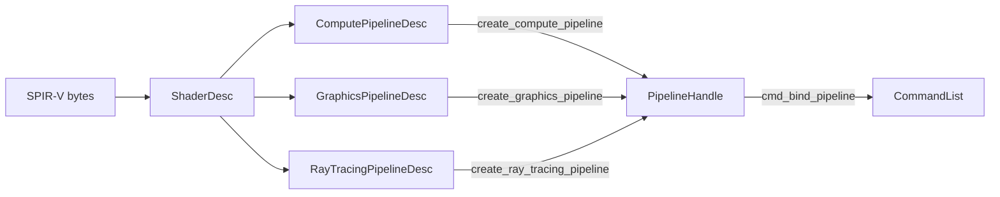

# Shaders and pipelines

Pipelines are created from SPIR-V. Their layout is fixed by the
[shader ABI](../shader_abi.md): one global heap set plus a root push block.
There is nothing to declare on the C3 side except the shader bytes.



## Shader input

```c3
const char[*] SPIRV = $embed("../shaders/main.comp.spv");
gpu::ShaderDesc shader = {
    .spirv       = SPIRV[..],
    .entry_point = "main",   // null selects "main"
    .debug_name  = "doubler",
};
```

The bytes and strings are borrowed for the create call only. Creation
reflects the entry point and validates the push block, heap bindings, and
stage interface. Mismatches return `SHADER_INVALID`.

## Compute pipelines

```c3
gpu::ComputePipelineDesc desc = { .shader = shader, .debug_name = "doubler" };
gpu::PipelineHandle pipeline = gpu::create_compute_pipeline(&device, &desc)!;
defer (void)gpu::destroy_pipeline(&device, pipeline);
```

## Graphics pipelines

```c3
gpu::Format[2] color_formats = { gpu::Format.RGBA16_FLOAT, gpu::Format.RGBA8_UNORM };
gpu::GraphicsPipelineDesc desc = {
    .vertex_shader   = { .spirv = VERT_SPIRV[..] },
    .fragment_shader = { .spirv = FRAG_SPIRV[..] },
    .color_formats   = color_formats[..],
    .depth_format    = gpu::Format.D32_FLOAT,     // UNDEFINED for no depth
    .sample_count    = gpu::SampleCount.ONE,
    .polygon_mode    = gpu::PolygonMode.FILL,     // LINE needs caps.line_polygon_mode
    .debug_name      = "scene",
};
gpu::PipelineHandle pipeline = gpu::create_graphics_pipeline(&device, &desc)!;
```

Pipeline identity is: shaders, color formats, depth format, sample count,
polygon mode. Everything else is command-time state in `GraphicsState`:

| `GraphicsState` field | Type | Contents |
|---|---|---|
| `viewport` | `Viewport` | x, y, width, height, depth range |
| `scissor` | `ScissorRect` | x, y, width, height |
| `raster` | `DynamicRasterState` | topology, cull mode, front face, depth bias |
| `depth` | `DepthState` | test, write, compare |
| `color` | `ColorState` | one `ColorTargetState` per color format |

`render_geometry_state(width, height)` returns a full-area viewport and
scissor with triangles, no culling, no depth, and an empty color packet.
Fill `color.targets` before drawing:

```c3
gpu::GraphicsState state = gpu::render_geometry_state(width, height)!;
gpu::ColorTargetState[2] targets = {
    gpu::color_blend_disabled(),
    gpu::alpha_blend(),
};
state.color.targets = targets[..];
state.raster.cull_mode = gpu::CullMode.BACK;
state.depth = { .test_enable = true, .write_enable = true, .compare = gpu::CompareOp.LESS };
```

Blend presets return a `ColorTargetState`: `color_blend_disabled(mask)`,
`alpha_blend()`, `premultiplied_alpha_blend()`, `additive_blend()`.
`uniform_color_state(slice, state)` fills a slice with one state and
returns the `ColorState`. `COLOR_WRITE_ALL` is the default mask.

`MAX_COLOR_ATTACHMENTS` is 8; use `DeviceCaps.max_color_attachments` for
the selected device.

## Ray-tracing pipelines

Require `DeviceDesc.enable_ray_tracing_pipelines`.

```c3
gpu::ShaderDesc closest_hit = { .spirv = CHIT_SPIRV[..] };
gpu::ShaderDesc[1] raygen = {{ .spirv = RGEN_SPIRV[..] }};
gpu::ShaderDesc[1] miss   = {{ .spirv = MISS_SPIRV[..] }};
gpu::RayTracingHitGroupDesc[1] hit_groups = {{
    .kind               = gpu::RayTracingHitGroupKind.TRIANGLES,
    .closest_hit_shader = &closest_hit,
}};
gpu::RayTracingPipelineDesc desc = {
    .ray_generation_shaders = raygen[..],
    .miss_shaders           = miss[..],
    .hit_groups             = hit_groups[..],
    .max_recursion_depth    = 1,          // 0 normalizes to 1
    .dynamic_stack_size     = false,
};
gpu::PipelineHandle pipeline = gpu::create_ray_tracing_pipeline(&device, &desc)!;
```

Hit groups: `TRIANGLES` may have closest-hit and any-hit shaders and no
intersection shader; `PROCEDURAL` requires an intersection shader. A null
shader pointer means the role is absent.

`get_ray_tracing_pipeline_info` returns the deterministic group order
(ray generation, miss, hit, callable ranges) and the normalized recursion
depth. `get_ray_tracing_shader_group_handles` copies handle bytes for a
group range into caller memory of `group_count * shader_group_handle_size`
bytes. `get_ray_tracing_shader_group_stack_size` reports the stack
requirement of one role in one group; with `dynamic_stack_size = true` the
application sums them and records
`cmd_set_ray_tracing_pipeline_stack_size`. See the
[cookbook](../cookbook.md#pack-an-sbt-and-trace).

Not supported: pipeline libraries, capture replay, deferred creation,
automatic stack sizing.

## Lifetime

```c3
gpu::destroy_pipeline(&device, pipeline)!;
```

Destruction never waits. Under `FULL` validation a pipeline named by a
recorded or submitted list returns `RESOURCE_IN_USE` until the list
retires. Under `TRUSTED` the application must still keep it alive through
use.

Equal descriptions on one device share a private cached pipeline; each
`PipelineHandle` is still a separate owner with its own lifetime. Pipeline
calls are thread-safe.

## Pipeline cache

```c3
usz size = gpu::get_pipeline_cache_size(&device)!;
char[] blob = mem::new_array(char, (sz)size);
usz written = gpu::get_pipeline_cache_data(&device, blob)!;
// persist blob[:written]; next run: RuntimeDesc.pipeline_cache_data = blob
```

The blob is opaque, driver-specific data. Store it with the adapter's
vendor, device, and driver identifiers. A rejected blob is a cache miss.

## Faults

| Cause | Fault |
|---|---|
| bad SPIR-V, missing entry point, ABI mismatch | `SHADER_INVALID` |
| unsupported format, sample count, polygon mode, or ray feature | `UNSUPPORTED_FEATURE` |
| inconsistent descriptor | `INVALID_ARGUMENT` |
| driver rejected the pipeline | `PIPELINE_CREATE_FAILED` |
| pipeline table full | `SLOT_TABLE_FULL` |
