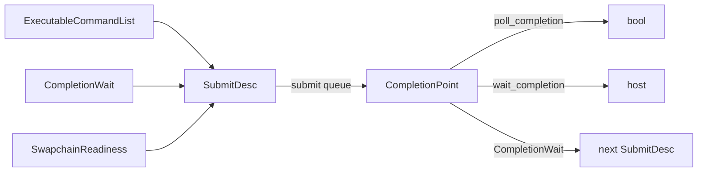

# Synchronization and submission

Barriers order work inside one command list. Completion points order work
across submissions, queues, and the host. Timestamps measure it.



## Stages

`StageMask` bits: `all`, `host`, `transfer`, `compute`, `vertex_shader`,
`fragment_shader`, `color_output`, `depth_output`, `present`, `indirect`,
`acceleration_structure_build`, `ray_tracing`. `all` and `present` cannot
be combined with others.

## Global barriers

```c3
gpu::Barrier compute_to_draw = {
    .before = { .compute },
    .after  = { .vertex_shader, .indirect },
};
gpu::cmd_barrier(&commands, &compute_to_draw)!;
```

A `Barrier` orders execution and memory between two stage sets. It names
no resource. Common pairs:

| Before | After | When |
|---|---|---|
| `.transfer` | `.compute` or `.vertex_shader` | after an upload copy |
| `.compute` | `.indirect` | compute wrote indirect arguments |
| `.compute` | `.host` | before host readback of compute output |
| `.transfer` | `.host` | before host readback of a copy |
| `.acceleration_structure_build` | `.compute`, `.ray_tracing` | before a query or trace |
| `.compute` | `.indirect, .acceleration_structure_build` | GPU-written build ranges |

A global barrier cannot change a texture layout.

## Texture barriers

A `TextureState` is a layout, a stage set, and read/write intent:

```c3
gpu::TextureState attachment = {
    .layout = gpu::TextureLayout.COLOR_ATTACHMENT,
    .stages = { .color_output },
    .access = { .read, .write },
};
gpu::TextureState sampled = gpu::sampled_at({ .fragment_shader });
gpu::TextureState storage = gpu::storage_at({ .compute }, { .write });
gpu::TextureState undefined = { .layout = gpu::TextureLayout.UNDEFINED };
gpu::TextureState present   = { .layout = gpu::TextureLayout.PRESENT };
```

Layouts: `UNDEFINED` (source only), `TRANSFER_SOURCE`,
`TRANSFER_DESTINATION`, `SAMPLED`, `STORAGE`, `COLOR_ATTACHMENT`,
`DEPTH_ATTACHMENT`, `PRESENT`. Zero access is valid only for `UNDEFINED`
and `PRESENT`.

Build a transition and record it:

```c3
gpu::TextureBarrier barrier = gpu::texture_transition(texture, undefined, attachment)!;
gpu::cmd_texture_barrier(&commands, &barrier)!;

gpu::TextureViewDesc mip0 = { .base_mip = 0, .mip_count = 1 };
gpu::TextureBarrier one_mip = gpu::texture_view_transition(texture, mip0, attachment, sampled)!;
```

`before` must be the state established by the last ordered use. The
library keeps no history and does not repair a wrong `before`. A
`TextureBarrier` value can be built inline as well; the helper functions
only check layouts.

On a ray-enabled device, shader stages also cover acceleration-structure
reads, and `.ray_tracing` covers all ray stages.

## Completion points

```c3
gpu::CompletionPoint point = gpu::submit(queue, &desc)!;
bool done = gpu::poll_completion(point)!;
gpu::wait_completion(point)!;                       // TIMEOUT_INFINITE
gpu::wait_completion(point, 1_000_000)!;            // 1 ms, or WAIT_TIMEOUT
```

A point identifies ordered completion on one queue. It is a plain copyable
value that stays valid until the device is destroyed; polling and waiting
never consume it. It is the only fence in the API: memory reuse, allocator
reuse, resource destruction, and presentation all wait on it. It does not
keep anything alive.

Both calls are thread-safe and may retire command units and retained
references as a side effect.

## Submission

```c3
gpu::ExecutableCommandList[2] lists = { first, second };
gpu::CompletionWait[1] waits = {{ .point = compute_done, .before = { .vertex_shader } }};
gpu::SubmitDesc desc = {
    .command_lists    = lists[..],
    .completion_waits = waits[..],
    .readiness        = acquired.readiness,        // first submit that writes a swapchain image
    .readiness_before = { .color_output },
};
gpu::CompletionPoint point = gpu::submit(queue, &desc)!;
```

`submit` targets the queue every list's allocator was created for. Lists
in one submit behave like one long list: a barrier in a later list orders
against commands in earlier ones. Each `CompletionWait` names a prior
point and the first stages on this queue that must wait for it. Host and
present are not valid wait destinations, and a transfer-only queue rejects
ray stages.

On success every list token and the readiness are consumed. On any
failure the lists stay executable and readiness stays unconsumed.
Submission is externally synchronized on the native queue.

Cross-queue rule: the wait orders execution and visibility but transfers
no ownership. Allocations touched by both queues need both roles in
`AllocationDesc.access`.

## Host visibility

A `Barrier` to `.host` makes GPU writes visible to the CPU after the
completion point completes. `flush_mapped_span` and
`invalidate_mapped_span` handle the cache side; neither waits. The order
is: write, flush, submit; then wait, invalidate, read.

## Timestamps

```c3
gpu::TimestampPoolDesc pool_desc = { .capacity = 64 };
gpu::TimestampPoolHandle pool = gpu::create_timestamp_pool(&device, &pool_desc)!;
defer (void)gpu::destroy_timestamp_pool(&device, pool);

gpu::cmd_reset_timestamps(&commands, pool, 0, 2)!;
gpu::cmd_write_timestamp(&commands, pool, 0, { .all })!;
gpu::cmd_write_timestamp(&commands, pool, 1, { .all })!;

// either resolve on the GPU...
gpu::cmd_resolve_timestamps(&commands, pool, 0, 2, dst_span)!;
// ...or read on the host after completion
ulong[2] raw;
gpu::read_timestamps(&device, pool, 0, 2, raw[..])!;
double ns = gpu::timestamp_delta_ns(&caps.timestamps, gpu::QueueKind.GRAPHICS, raw[0], raw[1])!;
```

`cmd_write_timestamp` takes exactly one stage bit. Slots must be reset
before each write; the library tracks no slot history. `read_timestamps`
never waits and returns `DEVICE_BUSY` with unspecified output when values
are not ready. `timestamp_delta_ns` applies the role's valid-bit width and
tick period from `TimestampCaps`; values from different native queues are
not comparable. `TimestampCaps.queues` lists the roles that support
timestamps.

## Faults

| Cause | Fault |
|---|---|
| invalid stage, access, layout, or range | `INVALID_ARGUMENT` |
| contradictory or unestablished state | `INVALID_RESOURCE_STATE` |
| stale, foreign, or consumed token | `INVALID_HANDLE`, `COMMAND_RECORDING_ERROR` |
| wait elapsed | `WAIT_TIMEOUT` |
| values not ready | `DEVICE_BUSY` |
| device loss | `DEVICE_LOST` |

No call here destroys a resource or idles the device.
