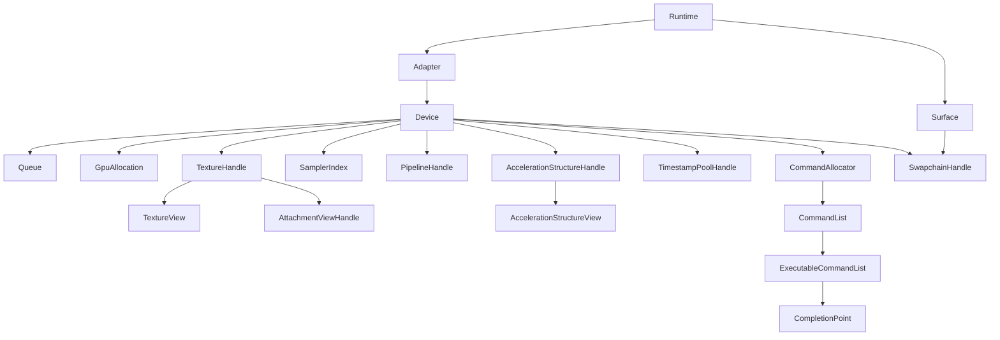
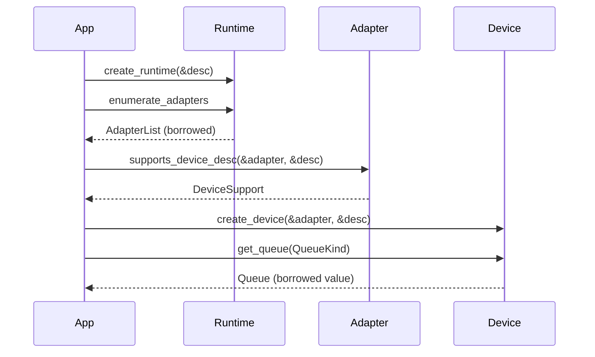
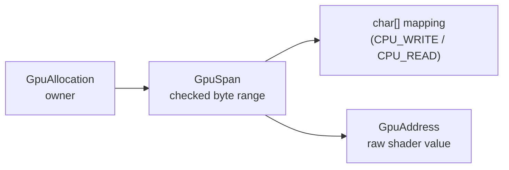
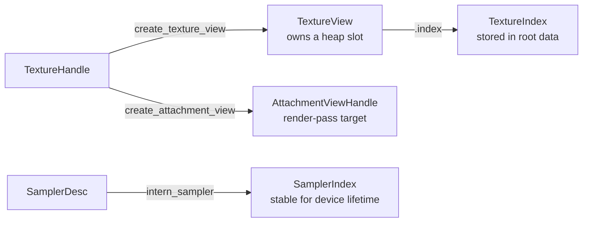
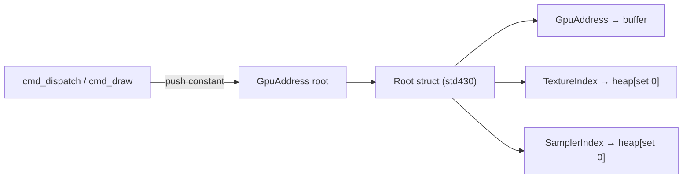
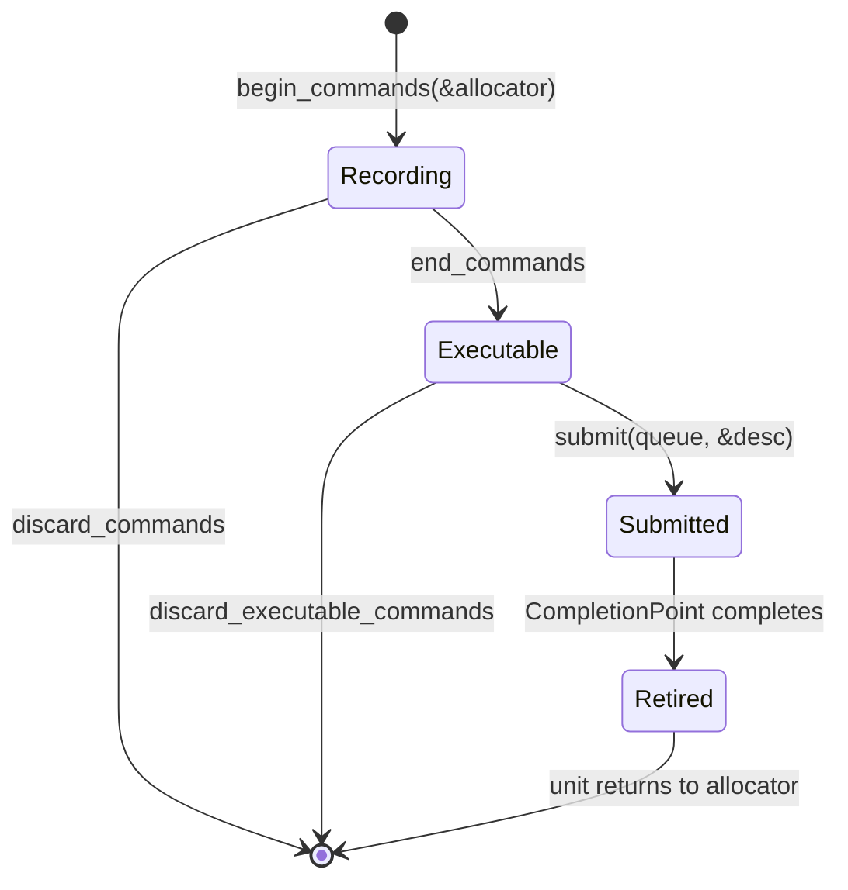
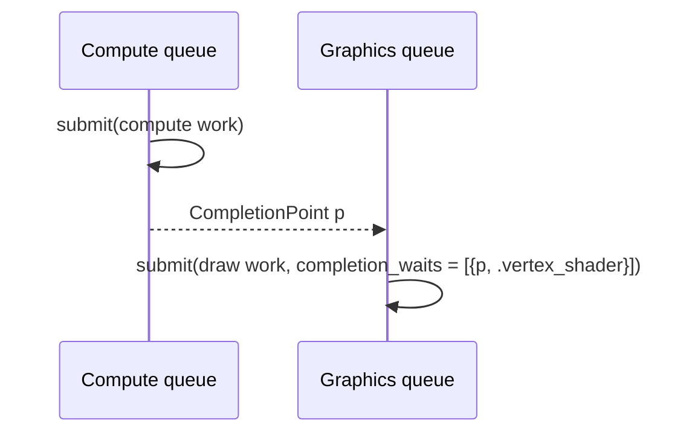
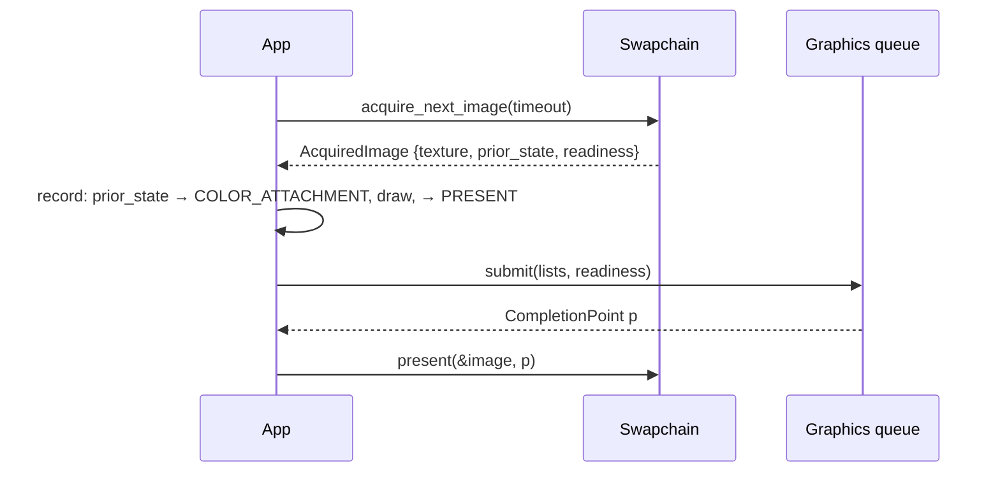

# Architecture

`gpu.c3l` is a thin, explicit GPU API for C3. The public model has six kinds
of thing: devices, queues, memory, resources, commands, and completion. The
backend is Vulkan 1.3 and is private.

The library does not track application texture state, insert barriers, defer
application-resource destruction, relocate memory, or schedule frames. The
application controls those operations explicitly.

Normal command recording uses preallocated scratch and inserts no implicit
GPU work or waits. Validation and completion retirement perform bookkeeping
whose cost depends on the references and submissions processed. Recycling
completed command storage does not transfer ownership of application resources.

## Modules

| Module | Purpose |
|---|---|
| `gpu` | The complete public API. |
| `gpu::surface::wayland`, `gpu::surface::x11`, `gpu::surface::win32` | One `create_surface` per platform. |
| `gpu::internal`, `gpu::internal::vk` | Private. No `vk::` or `vma::` type appears in a public signature. |

Importing a module creates nothing. The first runtime object is the one
returned by `create_runtime`.

SDL3 is not a dependency. Applications that use it pass its native window
properties to a surface module. See
[getting started](getting_started.md#step-2-a-triangle-in-an-sdl3-window).

## Object model



An arrow means "owns or must outlive". A parent refuses to be destroyed while
a child is live.

Handles are strongly typed values that carry a device identity and a
generation. They are copyable identifiers, not pointers. A stale handle is
rejected when validation can observe it. Every handle type has a zero
`*_INVALID` constant and an `is_valid` method that checks shape only.

Three values are not handles: `GpuAddress`, `TextureIndex`, and
`SamplerIndex` (plus `AccelerationStructureIndex`). They are raw numbers that
shaders read. They carry no owner or generation. The application keeps the
owning allocation, view, or device alive for as long as a shader can read the
value.

## Lifetime rules

- **Creation is transactional.** A create call returns a complete object or a
  fault with nothing left behind.
- **Destruction never waits.** A destroy call returns `RESOURCE_IN_USE` while
  a child is live and `DEVICE_BUSY` while work is incomplete. The handle stays
  valid on either fault. Wait on a completion point, destroy the child, retry.
- **Completion is the only fence.** `submit` returns a `CompletionPoint`.
  Reusing memory, reusing a command allocator, destroying a resource, and
  freeing an allocation all wait on the point that covers the last use.
- **Validation is optional.** `ContractValidation.FULL` adds ownership,
  generation, state, and lifetime checks, and retains resources named by a
  command list until it retires. `TRUSTED` checks only what is needed for host
  safety. Neither policy tracks memory reached through a `GpuAddress` or a
  shader index.

## Runtime, adapters, devices



A `Runtime` owns adapter discovery, the optional Vulkan validation layer, the
debug callback, and table capacities. `RuntimeDesc` also sizes the texture,
sampler, and acceleration-structure heaps.

A `DeviceDesc` requests queue roles, an optional presentation surface, and
optional features (sparse textures, ray queries, ray-tracing pipelines).
`supports_device_desc` is a preflight. `create_device` is authoritative.

Queues are semantic: `GRAPHICS`, `COMPUTE`, `TRANSFER`. Two roles may alias
one native queue. `DeviceCaps.async_compute` says whether compute is separate.
`QueueRequest.distinct_roles` demands separation; `single_queue` demands that
every role share one native queue.

## Memory



`allocate_memory` returns a `GpuAllocation`. `get_allocation_span` returns a
`GpuSpan` covering it. `checked_subspan` carves ranges. A span is non-owning.

| Memory class | Mapped | Use |
|---|---|---|
| `CPU_WRITE` | yes | uploads, root data, per-frame data |
| `CPU_READ` | yes | readback |
| `GPU_PRIVATE` | no | device-local buffers |
| `TEXTURE` | no | backing for placed and sparse textures |

Allocations are not relocated, so a `GpuAddress` is stable until the
allocation is freed. Host writes need `flush_mapped_span` before submission;
host reads need `invalidate_mapped_span` after completion. On coherent memory
both are no-ops, but the calls are always required.

## Textures and shader indices

A `TextureHandle` owns an image. Shaders do not see the handle. They see a
`TextureIndex` published by `create_texture_view` into the device-wide
bindless heap, and a `SamplerIndex` returned by `intern_sampler`.



Destroying a `TextureView` frees its slot immediately. A sampler index is
never freed before the device.

Texture layout is application state. Every transition names the exact
`before` state and the `after` state. The library does not remember the last
one.

## Shaders and pipelines

Pipelines take SPIR-V and an entry point. Creation validates the root push
block, the heap bindings, formats, and device limits, then deduplicates
against equal pipelines on the same device.

All generic shader data travels through root pointers:



Compute pushes one address. Graphics pushes a vertex address and a fragment
address. Ray tracing pushes one address to all stages. There is no
descriptor-set API. See [Shader ABI](shader_abi.md).

## Commands



A `CommandAllocator` is bound to one queue and owns a fixed number of
command units. `begin_commands` takes a unit and returns a one-shot
`CommandList`. `end_commands` consumes it and returns an
`ExecutableCommandList`. `submit` consumes accepted lists and returns one
`CompletionPoint`. A rejected submit leaves the lists executable.

The unit returns to the allocator when its completion point retires. An
allocator with `DEFAULT_COMMAND_ALLOCATOR_CAPACITY` (8) units can therefore
have 8 lists in flight.

Direct, indirect, and generated work share this lifecycle. Generated work
(GPU-written roots plus arguments) is capability-gated and needs a
reservation on the allocator before recording.

## Synchronization

Two barrier kinds exist:

- `Barrier` orders execution and memory between two `StageMask` sets. It has
  no resource identity.
- `TextureBarrier` changes a texture subresource from one `TextureState` to
  another. This is the only way to change a layout.

Within one queue, order comes from command order plus barriers. Across
queues, a `SubmitDesc.completion_waits` entry names a prior `CompletionPoint`
and the stages that must wait for it.



Host mapping operations do not imply GPU completion. Flush before submit,
wait before invalidate.

## Presentation



Acquisition is nonblocking by default and returns `WAIT_TIMEOUT` when no
image is ready. `SWAPCHAIN_OUT_OF_DATE` from acquire or present means resize.
Before `resize_swapchain` or `destroy_swapchain`: wait the last completion
point, then `wait_swapchain_presentations`. Neither lifecycle call waits on
its own.

## Threading

| Category | Operations |
|---|---|
| Externally synchronized | runtime and surface registry mutation; one swapchain; submit, present, and sparse bind on one native queue |
| Thread-safe | adapter queries; allocation, texture, view, sampler, pipeline, and acceleration-structure operations; completion poll and wait; operations on distinct objects |
| Thread-confined | a `CommandList` and all copies of it; the allocator while a recording is live |

Distinct allocators record in parallel. Moving an `ExecutableCommandList` to
a submit thread needs an application happens-before edge. Aliased queue roles
share one synchronization boundary.

### Backend lock order

Not an API contract. Listed so contributors can reason about contention.

```text
device operation pin
  device / resource
    texture-view cache  |  queue submission
                            queue retirement
                              allocator
                                command record
```

No path reacquires the device domain while holding a queue, retirement,
allocator, or command-record lock. No path holds two retirement locks. So:
recording through distinct allocators runs in parallel, submits to distinct
native queues are independent, and completion polling does not serialize a
native submit.

## Diagnostics and cost

`ContractValidation.FULL` and the Vulkan validation layer are independent
switches. `RuntimeDesc.debug_callback` receives structured `DebugMessage`
values synchronously, possibly from any thread. The callback must not call
back into the library.

Library scratch for normal recording is preallocated per allocator. FULL
validation adds a linear duplicate scan per retained reference. Completion
observation and lifetime operations can retire completed submissions, release
retained references, and recycle command units; this work is workload-dependent.

Non-wait operations insert no implicit GPU wait. Explicit completion waits
still block as requested. These guarantees imply neither fixed driver latency
nor allocation-free Vulkan calls. See [benchmarking](https://github.com/fesoliveira014/gpu.c3l/blob/main/docs/contributing/benchmarking.md)
for measurement guidance.

## Platform

Targets are `linux-x64` and `windows-x64` on C3 0.8.3. Required at runtime: a
Vulkan 1.3 loader and driver with synchronization2, dynamic rendering,
timeline semaphores, buffer device address, descriptor indexing, and extended
dynamic state. The library requires all of them; it does not emulate missing
features. Unsupported adapters fail `create_device` with
`UNSUPPORTED_FEATURE`.

Vendored dependencies: `vk`, `vma`, and `spvreflect` binding packages plus a
static VMA library per target. Shader compilation is an application build
step.
